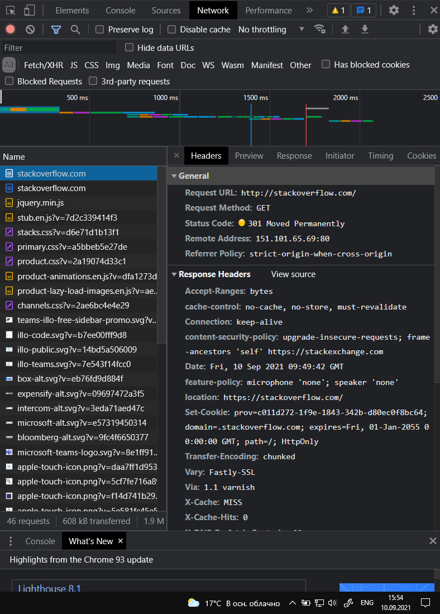

# Домашнее задание к занятию "3.6. Компьютерные сети, лекция 1"

1. Работа c HTTP через телнет.
- Подключитесь утилитой телнет к сайту stackoverflow.com
`telnet stackoverflow.com 80`
- отправьте HTTP запрос
```bash
GET /questions HTTP/1.0
HOST: stackoverflow.com
[press enter]
[press enter]
```
- В ответе укажите полученный HTTP код, что он означает?
  *
    Получен код `HTTP/1.1 301 Moved Permanently`, означает, что запрошенный ресурс был окончательно перемещён на другой URL.


2. Повторите задание 1 в браузере, используя консоль разработчика F12.
- откройте вкладку `Network`
- отправьте запрос http://stackoverflow.com
- найдите первый ответ HTTP сервера, откройте вкладку `Headers`
- укажите в ответе полученный HTTP код.
- проверьте время загрузки страницы, какой запрос обрабатывался дольше всего?
- приложите скриншот консоли браузера в ответ.

    * 
  
  

  * Get запрос на `https://stackoverflow.com/` обрабатывался дольше всего
  
  

3. Какой IP адрес у вас в интернете?
   * У меня публичная статика, светить свой ip я тут не буду:). Могу назвать номер автономной системы - 21299 :)
  
   
4. Какому провайдеру принадлежит ваш IP адрес? Какой автономной системе AS? Воспользуйтесь утилитой `whois`
   * Kar-Tel LLC, AS -21299

5. Через какие сети проходит пакет, отправленный с вашего компьютера на адрес 8.8.8.8? Через какие AS? Воспользуйтесь утилитой `traceroute`
   * `traceroute -An 8.8.8.8`
  ```bash
 7  195.208.208.250 [AS5480]  48.027 ms  47.610 ms  47.418 ms
 8  * 108.170.250.130 [AS15169]  51.313 ms *
 9  142.251.49.24 [AS15169]  55.009 ms * *
10  209.85.254.20 [AS15169]  59.560 ms * *
11  216.239.49.3 [AS15169]  58.224 ms 216.239.42.23 [AS15169]  57.476 ms 142.250.56.219 [AS15169]  57.460 ms
12  * * *
13  * * *
14  * * *
15  * * *
16  * * *
17  * * *
18  * * *
19  * * *
20  * * *
21  * 8.8.8.8 [AS15169]  56.953 ms  58.669 ms
  ```
  Начало трейса из соображения ИБ опубликовать не могу.

6. Повторите задание 5 в утилите `mtr`. На каком участке наибольшая задержка - delay?
   * mtr -zn 8.8.8.8
  ```bash
    7. AS???    195.208.208.232                    0.0%    24   53.5  49.9  49.2  53.5   1.0
    8. AS15169  108.170.250.113                   69.6%    24   52.4  52.4  52.2  52.5   0.1
    9. AS15169  142.251.49.158                    90.9%    23   59.9  60.2  59.9  60.4   0.3
    10. AS15169  216.239.57.222                     0.0%    23   60.7  60.7  60.3  62.5   0.4
    11. AS15169  142.250.56.15                      0.0%    23   59.9  59.8  59.5  60.1   0.1
    12. (waiting for reply)
    13. (waiting for reply)
    14. (waiting for reply)
    15. (waiting for reply)
    16. (waiting for reply)
    17. (waiting for reply)
    18. (waiting for reply)
    19. (waiting for reply)
    20. (waiting for reply)
    21. (waiting for reply)
    22. (waiting for reply)
    23. AS15169  8.8.8.8                            0.0%    23   59.8  59.7  59.4  60.3   0.2
  ```
  * Самая большая задержка на хосте `AS15169  216.239.57.222`

7. Какие DNS сервера отвечают за доменное имя dns.google? Какие A записи? воспользуйтесь утилитой `dig`
  * root servers:
    ```bash
    dns.google.             10800   IN      NS      ns3.zdns.google.
    dns.google.             10800   IN      NS      ns1.zdns.google.
    dns.google.             10800   IN      NS      ns2.zdns.google.
    dns.google.             10800   IN      NS      ns4.zdns.google.
    ```
  * А записи:
      ```bash
      dns.google.             900     IN      A       8.8.8.8
      dns.google.             900     IN      A       8.8.4.4
      ```   

8. Проверьте PTR записи для IP адресов из задания 7. Какое доменное имя привязано к IP? воспользуйтесь утилитой `dig`
  *
    ```bash
    vagrant@vagrant:~$ dig +short -x 8.8.8.8
    dns.google.
    vagrant@vagrant:~$ dig +short -x 8.8.4.4
    dns.google.
    ```

В качестве ответов на вопросы можно приложите лог выполнения команд в консоли или скриншот полученных результатов.

---

